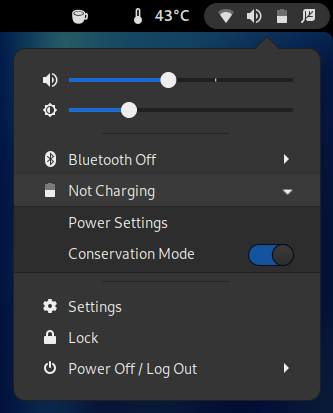
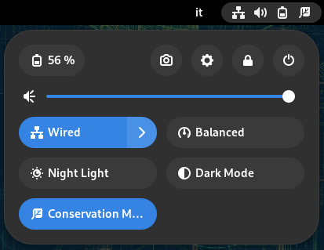

# gnome-shell-extension-ideapad
Lenovo IdeaPad goodies for GNOME Shell

*At the moment the extension only provides an easy and user-friendly way to toggle the battery conservation mode available on Levono Ideapad laptops and visually get its current state.*

# Installation
Simply install the extension from the [official GNOME extensions website](https://extensions.gnome.org/extension/2992/ideapad/) (recommended). Alternatively, manually download or clone the repository under `~/.local/share/gnome-shell/extensions/ideapad@laurento.frittella`

In both cases, few additional steps are required. Please check the dedicate following section.

In case you would like to have a look at the code, please consider that `master` branch targets GNOME Shell versions 43+. Previous versions are still supported in branch `pre-43`.

# Usage
The extension adds a new entry *Toggle Conservation Mode* to the panel and shows an icon on the status menu to indicate when the battery conservation mode is enabled.

If your particular laptop model supports it, the conservation mode limits battery charging to 55-60% of its capacity to improve battery life. It is particularly useful when the laptop runs on external power most of the time.

| GNOME Shell < 43    | GNOME Shell >= 43      |
|---------------------|------------------------|
|  |  |

# Additional Required Settings
Your desktop user needs read-and-write access to a specific sysfs file that is normally owned by the root user. The easiest way to achieve that is using `sudo`. The following steps have been tested on Debian, but they should work on any modern GNU/Linux system. In case of doubts, please refer to your specific distribution documentation.

* Depending on your distro, you need to use the group `sudo` (e.g. Debian and Ubuntu) or `wheel` (e.g. Arch and Fedora) here. In case of doubt, run the command `groups` in a terminal and see which of the two is listed in the output.

  Add the following entry to your system sudoers configuration (e.g. `/etc/sudoers.d/ideapad`). **Make sure to replace** `%sudo` with `%wheel` if needed.
  ~~~
  %sudo ALL=(ALL) NOPASSWD: /usr/bin/tee /sys/bus/platform/drivers/ideapad_acpi/VPC????\:??/conservation_mode
  ~~~

* To make sure the `ideapad_laptop` kernel module gets loaded automatically at boot, simply add it to the file `/etc/modules`

To summarize and for easy reference...
~~~
# Don't forget to replace %sudo with %wheel if needed!
#
$ echo "%sudo ALL=(ALL) NOPASSWD: /usr/bin/tee /sys/bus/platform/drivers/ideapad_acpi/VPC????\:??/conservation_mode" | sudo tee /etc/sudoers.d/ideapad
$ echo "ideapad_laptop" | sudo tee -a /etc/modules
~~~

# Wrong battery estimation displayed
Depending on the kernel version you are running, a minor cosmetic issue might still exist. However, if the permanent "Estimating..." battery status displayed in GNOME bugs you, there is also a solution.

Actually, this issue should be fixed in kernels 5.19+. If you are running an older kernel, you can try applying [the patch here](https://git.kernel.org/pub/scm/linux/kernel/git/torvalds/linux.git/commit/?id=185d20694a8aceb4eda9fc1314cbaad0df0aab07). Thanks to Martino Fontana for pointing this out.

Alternatively, you could use the patch I initially suggested in [this uPower merge request](https://gitlab.freedesktop.org/upower/upower/-/merge_requests/46). However, I would personally advice to go for the kernel patch. It is a much cleaner solution.
